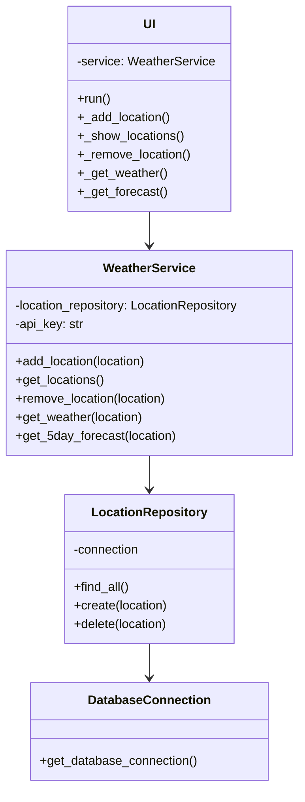
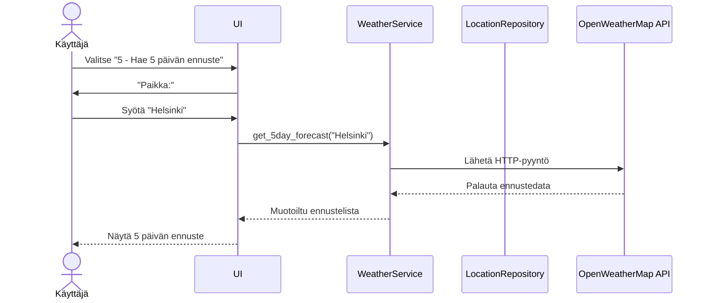

# Arkkitehtuuri

## Sovelluslogiikka

Sovellus noudattaa kolmikerroksista kerrosarkkitehtuuria, jossa käyttöliittymä, sovelluslogiikka ja tietokantakerros on erotettu toisistaan.

## 1.Käyttöliittymä(ui.py)

- **UI-luokka**: Hoitaa kaiken käyttäjän kanssa vuorovaikutuksen
- Näyttää valikon, lukee syötteet, tulostaa tulokset
- Kutsuu `WeatherService`
- Metodit: `run()`, `_add_location()`, `_show_locations()`, `_remove_location()`, `_get_weather()`, `_get_forecast()`

## 2.Sovelluslogiikkakerros (service/weather_service.py)
- **WeatherService-luokka**: hoitaa kaiken säätietojen logiikan
- Hakee säätiedot OpenWeatherMap API:sta
- Hallinnoi paikkatietoja `LocationRepository`:n kautta
- Metodit: `add_location()`, `get_location()`, `remove_location()`, `get_weather()`, `get_5day_forecast()`

## 3.Tietokantakerros (repositories/location_repository.py)
- **LocationRepository-luokka**: Hoitaa paikkatietojen tallennuksen
- Toteuttaa Repository-suunnittelumallin
- Metodit: `find_all()`, `create()`, `delete()`

## Tietojen tallennus

Paikkatiedot tallennetaan SQLite-tietokantaan `locations`-tauluun.
`LocationRepository`-luokka huolehtii tietokantaoperaatioista ja noudattaa Repository-suunnittelumallia.

## Päätoiminnallisuudet

### 5 päivän sääennusteen hakeminen

Kun käyttäjä valitsee valikosta vaihtoehdon "5 - Hae 5 päivän ennuste" ja syöttää paikan nimen, sovellus toimii seuraavasti:

