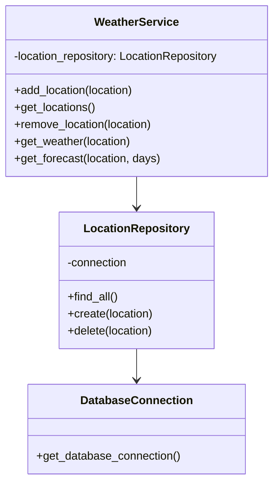
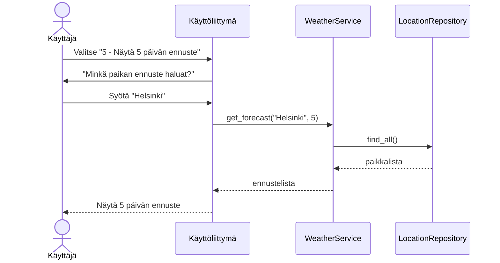

# Arkkitehtuuri

## Sovelluslogiikka

Sovellus noudattaa kerrosarkkitehtuuria, jossa käyttöliittymä on eriytetty sovelluslogiikasta.

## Käyttöliittymä

Käyttöliittymä on toteutettu tekstipohjaisena `index.py`. Se tarjoaa valikon, jonka kautta käyttäjä voi:

- Lisätä uusia paikkoja
- Tarkastella tallennettuja paikkoja
- Poistaa paikkoja
- Katsoa nykyistä säätä paikalle
- Katsoa 5 päivän sääennusteen paikalle

Käyttöliittymä kutsuu `WeatherService`-luokan metodeja ja näyttää tulokset käyttäjälle.

## Tietojen tallennus

Paikkatiedot tallennetaan SQLite-tietokantaan `locations`-tauluun.
`LocationRepository`-luokka huolehtii tietokantaoperaatioista ja noudattaa Repository-suunnittelumallia.

## Päätoiminnallisuudet

### 5 päivän sääennusteen hakeminen

Kun käyttäjä valitsee valikosta vaihtoehdon "5 - Näytä 5 päivän ennuste" ja syöttää paikan nimen, sovellus toimii seuraavasti:

Sekvenssikaavio kuvaa uuden sääennustetoiminnallisuuden toimintaa. Käyttöliittymä kutsuu `WeatherService`-luokan `get_forecast`-metodia, joka hakee tallennetut paikat `LocationRepository`:n kautta. Ennusteet palautetaan käyttöliittymälle, joka näyttää ne käyttäjälle. 

